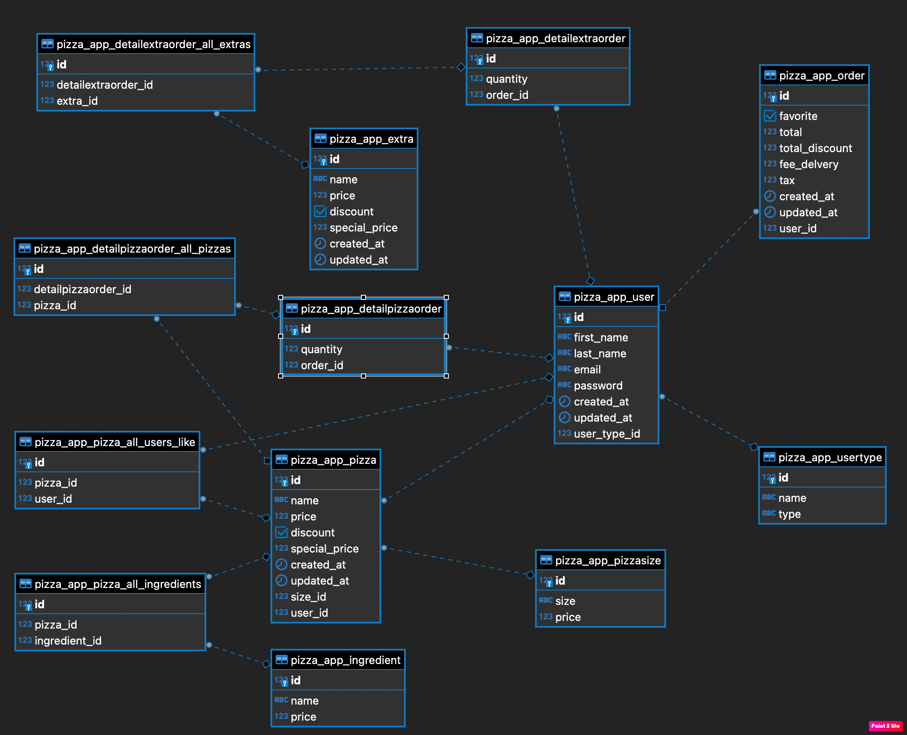

# Proyecto Personal PIZZA TIME

### No olvidar hacer

```
python manage.py makemigrations
python manage.py migrate
```
Hacer click [aquí](http://52.67.195.126/) ver proyecto en AWS

El modelo cumple las siguientes reglas de negocio:

- El usuario tiene perfiles (type user (ejemplo: user/admin/cliente))
- El usuario puede crear sus propios tipos de pizzas (solo las del usuario admin se van a mostrar en el Home para ser seleccionadas por cualquier usuario (cliente))
- Una pizza puede tener muchos ingredientes y cada ingrediente puede estar en muchas pizzas (relacion many to many)
- Un "Detalle de orden de Pizzas" puede tener muchas "Pizzas" y una "Pizza" puede estar en muchos "Detalles de ordenes de Pizza" 
- Un "Detalle de orden de Extras" puede tener muchos "Extras" y un "Extra" puede estar en muchos "Detalles de ordenes de Extras"
- Un "Detalle de orden de Pizzas" puede SOLO estar asociada a una Orden, y una Orden puede tener muchos "Detalles de ordenes de Pizza"
- Un "Detalle de orden de Extras" puede SOLO estar asociada a una Orden, y una Orden puede tener muchos "Detalles de ordenes de Extras"
- Un usuario puede seleccionar como "Favoritos" una Orden (field "favorite")
- Un usuario podra dar "like" a muchas pizzas y a su vez una Pizza puede ser favorita de muchos usuarios (many to many)
- Se pueden aplicar descuentos a cada ingrediente, pizza u orden
- El usuario admin puede asignar descuentos a los usuarios, directamente o por algun criterio, ejemplo cantidad de compras
- El cliente podra o no usar su descuento, pero no sera acumulable (field discount_used)


## MODELO ENTIDAD-RELACION


